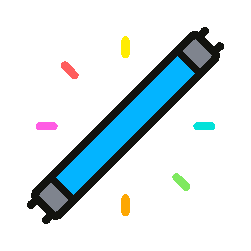

 

<h1 style="border-bottom: none; text-transform: uppercase; letter-spacing: 4px";>Neon Palette Themes</h1>

 - 7 different colors - 

 

<h4 style="letter-spacing: 2px; text-transform: uppercase; color: #03b4ff;">Blue</h4>

 

<h4 style="letter-spacing: 2px; text-transform: uppercase; color: #ff5e5e;">Red</h4>

 

<h4 style="letter-spacing: 2px; text-transform: uppercase; color: #7fe960;">Green</h4>

 

<h4 style="letter-spacing: 2px; text-transform: uppercase; color: #ff5ce4;">Pink</h4>

 

<h4 style="letter-spacing: 2px; text-transform: uppercase; color: #ffec03;">Yellow</h4>

 

<h4 style="letter-spacing: 2px; text-transform: uppercase; color: #02e1d9;">Cyan</h4>

 

<h4 style="letter-spacing: 2px; text-transform: uppercase; color: #fda703;">Orange</h4>

 
 

## Installation

Search "Neon Palette Themes" in the extension manager in VSCode and installing from there.

## Contributing

Contributions and PRs are highly encouraged and if you find something that needs to be fixed, please do not hesitate [opening an issue](https://github.com/Jofa8/neon-palette-themes/issues/new).

## Author

[Joel Fano](https://github.com/Jofa8)

## License

[Apache-2.0 License](LICENSE)

